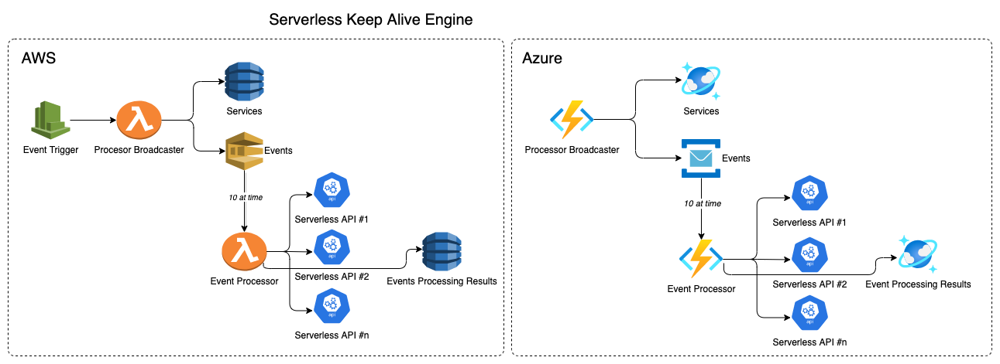

# serverless-keep-alive-engine
This is a simple keep alive engine to avoid the "cold" start up of AWS Lambda and Azure Functions (same architecture can be used for Google)

## High Level Architecture
